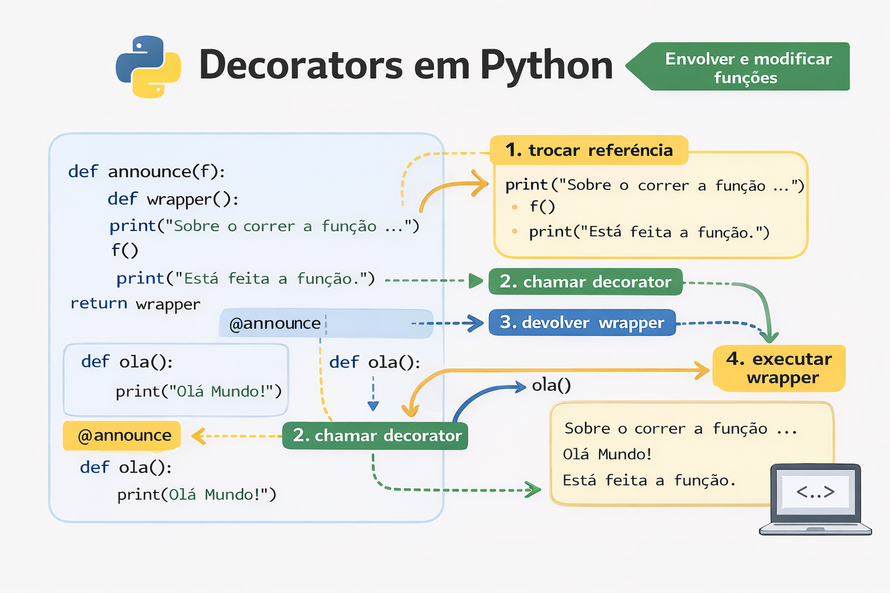

# Decorators em Python 🐍

Este repositório contém uma série de exercícios práticos sobre **Decorators em Python**,
desenvolvidos no âmbito da formação de **Programação Avançada em Python – IEFP**.

## 📚 Conteúdo

- Exercício 1 – Fluxo de execução de um decorator
- Exercício 2 – Reutilização do mesmo decorator
- Exercício 3 – Mensagens informativas no decorator
- Exercício 4 – Uso de *args e **kwargs
- Exercício 5 – Criação de um novo decorator (`@maiusculas`)

## 🎯 Objetivo

Consolidar os conceitos fundamentais de:
- Decorators
- Wrapper
- Reutilização de código
- Encapsulamento de comportamento
- Boas práticas em Python

## 🛠️ Tecnologias
- Python 3

## 👩‍💻 Autora
Palmira Solochi  
Formação: Técnico de Programação – IEFP
